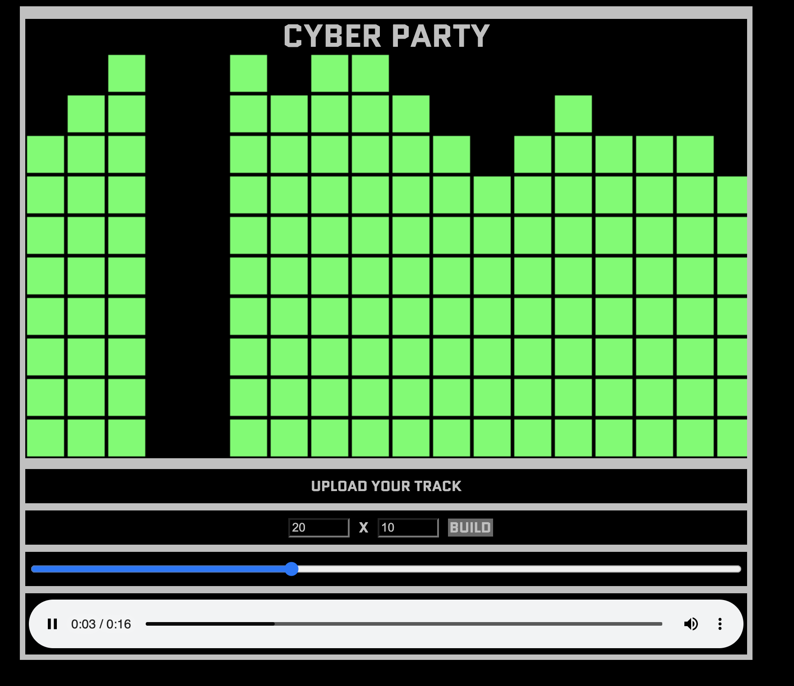

# Analyser

### About

A lightweight playground app—born in 2019—built to prototype and explore ideas.
This repo contains the first dummy applications that evolved into the current experiment set.

